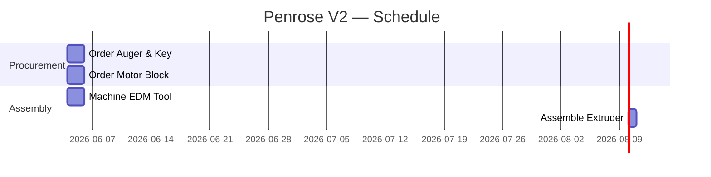

# Project Breakdown

Turn a high-level project brief into a fully decomposed technical plan with work packages, schedule, risks, and architecture decisions — ready for ClickUp import and team execution.

## When to Use
- A new hardware, software, or mixed project is being kicked off
- User has a goal but needs it broken into actionable phases and tasks
- User asks for a Gantt, WBS, or risk register
- Before creating tasks in ClickUp — use this first so ClickUp reflects a real plan

## Phase 1 — Requirements Extraction

Before decomposing, extract and classify requirements from the user:

| Type | Examples |
|---|---|
| **Functional (FR)** | What the system must do |
| **Non-Functional (NFR)** | Performance, reliability, safety, scalability, manufacturability |
| **Interface** | Hardware-software boundaries, communication protocols, APIs |
| **Constraints** | Budget, timeline, team size, vendor lock-in, tooling |

If any of these are missing, ask for them before proceeding. A plan built on incomplete requirements will be wrong.

## Phase 2 — Work Breakdown Structure (WBS)

Decompose the project into 4 levels:

| Level | Name | Example |
|---|---|---|
| 1 | Phase | `3. Hardware Development` |
| 2 | Deliverable | `3.2 Extruder Assembly` |
| 3 | Work Package | `3.2.1 Machine Barrel` |
| 4 | Activity | `3.2.1.1 Face-turn and bore to spec` |

For hardware/manufacturing projects, standard phases:
1. Concept & Requirements
2. Design & Architecture
3. Procurement & Fabrication
4. Assembly & Integration
5. Test & Validation
6. Handover / Deployment

For software projects:
1. Discovery & Architecture
2. Core Implementation
3. Integration & API Layer
4. Testing & QA
5. Release & Monitoring

Save output to: `outputs/{project-slug}/wbs.md`

## Phase 3 — PERT Effort Estimation

For each work package at Level 3, estimate:

| Field | Formula |
|---|---|
| Optimistic (O) | Best case, no surprises |
| Most Likely (M) | Normal execution |
| Pessimistic (P) | Murphy's Law |
| **PERT Estimate** | **(O + 4M + P) / 6** |
| Std Deviation | (P - O) / 6 |

Use PERT estimates to set realistic task durations. Never use best-case as the default.

## Phase 4 — Gantt Chart & Critical Path

Build the schedule from PERT estimates:

1. Identify **dependencies** (Finish-to-Start, Start-to-Start, Finish-to-Finish)
2. Identify **external dependencies** (vendor deliveries, regulatory approvals, component lead times)
3. Calculate the **critical path** — the longest path from start to end with no slack
4. Flag critical-path tasks in ClickUp with `priority = urgent`
5. Render as Mermaid Gantt:



Save output to: `outputs/{project-slug}/gantt.md`

## Phase 5 — Architecture Decision Records (ADRs)

For any project with significant design choices, document each key decision:

```
## ADR-001: [Decision Title]

**Context**: Why is this decision needed?
**Options Considered**:
  - Option A: [description] — Pros: ... Cons: ...
  - Option B: [description] — Pros: ... Cons: ...
**Decision**: [What was chosen and why]
**Consequences**: [Trade-offs, limitations, future constraints]
**References**: [Links to datasheets, papers, prior art]
```

Save to: `outputs/{project-slug}/adr.md`

## Phase 6 — Risk Register

For every project, maintain a risk register. Use this standard table:

| # | Risk | Category | Probability | Impact | Score | Mitigation | Owner | Status |
|---|------|----------|-------------|--------|-------|------------|-------|--------|
| R01 | Auger lead time > 2 weeks | Supply Chain | Medium | High | 6 | Order from 2 vendors in parallel | Ayush | Open |

**Categories:** Technical · Schedule · Cost · Supply Chain · External · Safety · People

**Scoring:**
- Probability: Low=1, Medium=2, High=3
- Impact: Low=1, Medium=2, High=3, Critical=4
- Score = Probability × Impact

**Action thresholds:**
- Score ≥ 6 → Active mitigation required, assign owner, set deadline
- Score 4–5 → Monitor weekly
- Score ≤ 3 → Log and accept

**Risk Review Cadence:** Review the register at every weekly check-in. Close risks that have passed; escalate any score that has risen since last review.

Save to: `outputs/{project-slug}/risk_register.md`

## Phase 7 — Compile Master Plan

Combine all outputs into a single project brief for the team:

```
outputs/{project-slug}/project_brief.md

1. Executive Summary (1 paragraph)
2. Project Scope & Objectives
3. Requirements (FR, NFR, Constraints)
4. System Architecture / ADRs
5. Work Breakdown Structure
6. Project Schedule (Gantt)
7. Resource Plan (who does what)
8. Risk Register
9. Open Questions & Assumptions
10. External References & Links
```

This brief becomes the source document for the ClickUp Doc (see `clickup-docs` skill).

## Asking the Right Questions

Before starting decomposition, the agent MUST ask (and record answers to):

1. What does "done" look like — what is the measurable acceptance criterion?
2. What is the hard deadline, and why?
3. Who is on the team and what are their skills / capacity?
4. What has already been decided (technology, vendor, design)?
5. What are the top 3 unknowns that could kill this project?
6. Are there similar past projects or prior art we can reference?
7. What external dependencies exist (vendors, approvals, other teams)?

**Never produce a plan without at least a partial answer to #1, #2, and #5.**

## Output Files

| File | Contents |
|---|---|
| `outputs/{slug}/wbs.md` | Full WBS with effort estimates |
| `outputs/{slug}/gantt.md` | Gantt + critical path |
| `outputs/{slug}/adr.md` | Architecture Decision Records |
| `outputs/{slug}/risk_register.md` | Risk register with owners |
| `outputs/{slug}/project_brief.md` | Compiled master plan |
